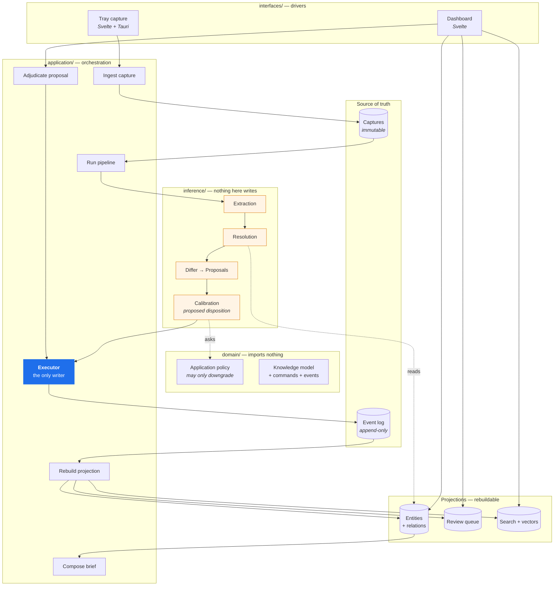
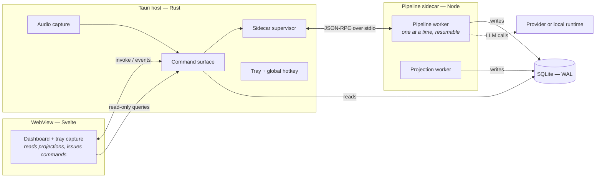
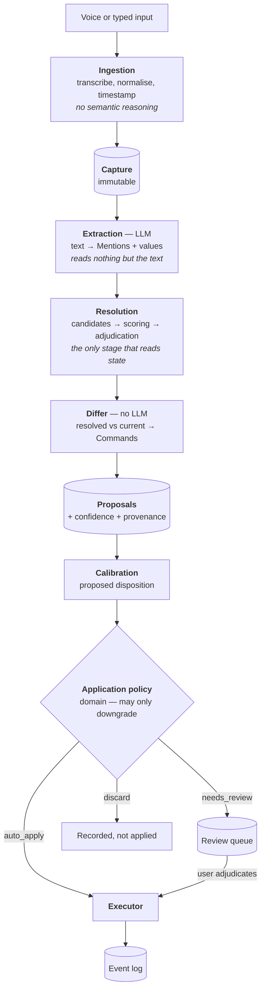
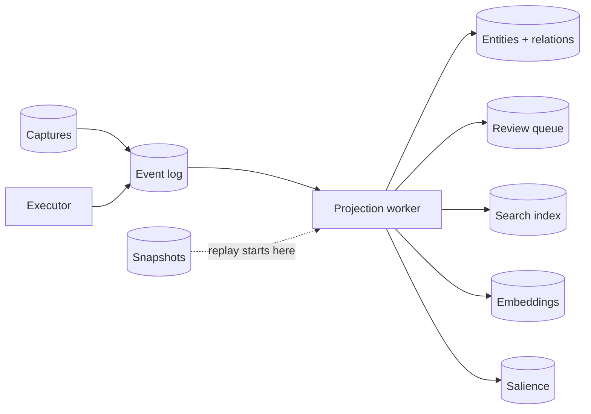

# Otto — Architecture Design

> Status: accepted for MVP. Product requirements live in [`prd.md`](./prd.md); vocabulary in [`CONTEXT.md`](../CONTEXT.md); settled decisions in [`docs/adr/`](./adr/).
>
> This document describes the whole MVP: the write path, the read path, enrichment, the runtime, and the data model. Where an ADR has already decided something, this document says how the decision is realised rather than re-arguing it. Four companion specifications carry the detail this document only sketches: [`schema.md`](./schema.md) is the field-level model, [`triage.md`](./triage.md) the confidence and disposition rules, [`runtime.md`](./runtime.md) the process model and local inference, and [`salience.md`](./salience.md) the surfacing rules. §12 covers what is genuinely undecided.

## 1. What this architecture has to be good at

Otto is a single-user desktop application that turns prose into a maintained knowledge base. Four properties of that job drive every structural decision below.

**It is probabilistic in the middle and exact at the edges.** Text arrives, an LLM reads it, and something definite happens to the user's data. The interesting failures live at the transition. The architecture's central move is to make that transition a place: a directory that cannot write (ADR-0003), a single executor that can, and an explicit stage between them where uncertainty turns into a decision.

**Its history is part of what it stores.** Otto's subject is not the current state of the user's knowledge but how that understanding changed (ADR-0002). The event log is therefore the model, not an audit trail beside it (ADR-0005), and every read surface is derived from it.

**Trust is the product metric** (PRD §8). Every fact the UI shows must be able to name the Capture it came from, the Proposal that produced it, and the model that inferred it. That is a constraint on the data model, not on the UI.

**It must run entirely on one machine.** Cloud inference is an option, never a requirement (ADR-0008). This forces every LLM interaction through a port narrow enough that a local model can satisfy it, and it forces the latency budget to assume the slow case.

Two things it explicitly does *not* need to be good at: scale, and swappability. There is one user and one machine, so throughput is a non-goal, and ADR-0001 already establishes that the layering buys testability rather than the ability to change databases. Wherever those two pull against clarity, clarity wins.

## 2. The shape in one picture



Read it as three claims. Everything probabilistic is in one box and none of it touches storage. One component writes, and it writes only to the log. Everything the user reads is derived from the log and can be thrown away.

## 3. Layers and the rules between them

The tree is ADR-0001's, with the surface and enrichment paths now placed.

```
src/
├── domain/          # the model of the world. imports nothing else in src/.
│   ├── knowledge/   # person, project, idea, event, task, relation
│   ├── events/      # past tense, immutable, no confidence
│   ├── commands/    # imperative, rejectable, carries confidence
│   ├── policies/    # application policy, merge policy, retention
│   └── values/      # entity-ref, provenance, time-range
│
├── capture/         # ingestion. normalisation only, nothing semantic.
│
├── inference/       # the probabilistic half. NOTHING HERE WRITES.
│   ├── extraction/
│   ├── resolution/  # candidates → scoring → adjudication
│   ├── proposal/    # the differ
│   ├── calibration/ # thresholds, proposed disposition, sampling, eval set
│   ├── duplicates/  # candidate generation aimed at the entity table
│   └── salience/    # what deserves attention (§8)
│
├── application/     # use cases. sequences, not rules.
│   ├── pipeline/    # ingest, run, apply, adjudicate
│   ├── projection/  # rebuild, subscribe, snapshot
│   └── surface/     # briefs, search, entity reads
│
├── ports/           # interfaces in our vocabulary
├── infrastructure/  # SQLite, Drizzle, LLM vendors, embeddings, audio
└── interfaces/      # Svelte UI, Tauri commands, background workers
```

Four rules hold it together, and three of them are lint-enforced from the first commit rather than maintained by discipline — ADR-0001 and ADR-0003 both note that these are precisely the boundaries that erode silently.

1. **`domain/` imports nothing else in `src/`.** It is the part that would survive a rewrite of everything else.
2. **Nothing in `inference/` performs a write.** Enforced structurally: no module in `inference/` may import a repository port, the event store port, or anything from `application/`. This is the rule the whole tree exists to express.
3. **Only the composition root imports `infrastructure/`.** Everyone else depends on `ports/`.
4. **`domain/` never learns the word "confidence."** Confidence is machinery, not knowledge (ADR-0002). The domain policy is asked about a *kind of change*, never about a number.

The fourth is not mechanically checkable in general, but its most likely violation is: a grep for `confidence` under `domain/` runs in CI alongside the import rules.

**One layering deviation from ADR-0001 is worth naming.** `capture/` sits beside `inference/` rather than inside `application/`, despite being orchestration by any strict reading. It earns the separation because ingestion is the stage most likely to become a separate process later (new ingress paths are the first post-MVP item, PRD §7.2), and because it is the one stage with a hard rule of its own: it performs no semantic reasoning. Keeping it a peer keeps that rule visible.

## 4. Runtime and process model

Otto is a Tauri application: a Rust host process and a WebView running Svelte. That gives three places code can run, and where each stage runs is decided below on its own merits.

**The pipeline runtime is a Node sidecar** spawned and supervised by the Tauri host, speaking JSON-RPC over stdio, with SQLite in WAL mode shared between the writing sidecar and the reading host (ADR-0013). Rewriting the pipeline in Rust was the honest alternative and lost on ecosystem grounds; `runtime.md` §1 has the full comparison. A crashing sidecar restarts with backoff and, because the pipeline is resumable per stage, resumes rather than replays — degrading to "Captures accumulate," which is a state §11 already handles.



**The UI never runs pipeline work.** Extraction on a long note against a local model can take tens of seconds; anything sharing a thread with the capture window makes capture feel expensive, and PRD §4.1 makes cheap capture the first principle. Capture's synchronous obligation ends at "the Capture is durably stored" — everything after that is asynchronous and invisible.

**The pipeline is single-threaded and serialised.** One Capture is processed at a time. At single-user volume there is no throughput argument for concurrency, and serialising removes a whole class of problem: two notes mentioning the same new Sarah cannot race to create her, and resolution always reads a projection that is not being concurrently mutated by a sibling run. This is a deliberate trade of latency-under-burst for the elimination of an entire failure mode.

**The pipeline is resumable, not transactional.** Each stage records its output against the Capture before the next begins. A crash mid-extraction leaves a Capture with no Proposals, which the worker picks up on restart; a crash after extraction resumes at resolution rather than re-billing the LLM call. This is what PRD §4.7's restartability requires at the machinery level: a week offline is a queue of Captures at known stages, not a backlog to clear by hand.

**Projection rebuilds run in their own worker** so that a full rebuild — which ADR-0005 makes a routine operation rather than a disaster recovery step — never blocks capture or the pipeline.

## 5. The write path

The pipeline is ADR-0007's shape: retrieval → constrained generation → deterministic application. This section says what each stage owns and, more importantly, what it is forbidden from knowing.



### 5.1 Ingestion

Ingestion turns arriving input into a Capture and stops. Transcription, whitespace and transcript cleanup, timestamping, and idempotency — nothing that requires understanding what the text means. The temptation is constant: "while we're here, we could notice this note has a date in it." That noticing belongs to extraction, and moving it earlier turns a normaliser into a second, undisciplined extractor.

The Capture is written before anything downstream runs, and is never modified afterwards. Everything Otto later believes points back to it.

**Transcript correction does not weaken that.** A Capture holds the raw transcript and, optionally, a user-corrected text; correcting one appends a `CaptureTranscriptCorrected` event and overwrites nothing (ADR-0014). Extraction reads the corrected text where one exists. Immutability is preserved exactly as stated — the correction is an event like any other — while a mis-heard name stays fixable rather than becoming a permanent wrong entity.

**Idempotency** is keyed on the Capture. A stable capture id is derived at ingestion — from the source, its timestamp, and a content hash — so a retried voice upload or a double-delivered future email ingress produces the same Capture rather than a second one. Every downstream artifact derives its id deterministically from the Capture id, the stage, **the provider and model version**, and an ordinal. Re-running extraction under the same model produces the same Proposal ids and applying them twice is a no-op rather than a duplicate Sarah; re-running under a *different* model produces new ids and therefore new Proposals, which is the correct behaviour — a better model should be able to say something new about an old Capture, and an id derived from the Capture alone would silently prevent that (ADR-0011). Re-extraction is a manual, scoped action rather than automatic on model upgrade, with one exception: a corrected transcript re-runs its own Capture, because the user has said the input was wrong (`runtime.md` §5).

### 5.2 Extraction

An LLM reads the Capture text and returns structured output: Mentions of entities as they appeared, and the field values claimed about them. It reads *nothing but the text* — no database access, no entity list, no prior knowledge of who Sarah is. That constraint is what makes extraction testable against a fixed corpus of notes with fixed expected output, which is the foundation of the eval set (ADR-0006). A stage that reads current state cannot be tested that way, because its correct output changes as the database does.

Schema-constrained output, temperature 0, and the provider and model version recorded on everything produced (ADR-0008). Extraction reports its own `p(extraction correct)`, kept separate from resolution's confidence throughout.

**The output schema is generated from `schema.md`**, not hand-written beside it. That is what makes "the model cannot invent a field name" structural rather than aspirational — an unknown field fails parsing before it reaches the differ. Extraction also resolves relative dates against the Capture timestamp and returns a precision marker with each one (`schema.md` §8), since "sometime next quarter" and "on the 4th" must not become indistinguishable timestamps.

### 5.3 Resolution

The only stage that reads current knowledge, and mostly not an LLM (ADR-0007). Three steps:

**Candidate generation** is deterministic and cheap: exact alias hits, fuzzy name match, and embedding nearest-neighbours against the entity projection, narrowing thousands of entities to a handful. Required regardless of how good the model is, because the entity graph does not fit in a context window.

**Scoring** ranks candidates on features Otto controls — name similarity, co-occurrence with other entities resolved in the same Capture, recency of contact, type agreement. **This is where the confidence number comes from**, not from the model's self-report, which is a token distribution rather than a probability.

**Adjudication** hands the note and the top three or four candidates to an LLM only when scoring leaves the case genuinely ambiguous. It picks one or none. Its output is a choice among presented candidates — it cannot invent an entity id, because the only ids it has seen are the ones it was given.

Resolution is deliberately biased toward "none of these" over a wrong match (ADR-0009). A duplicate Person is recoverable by merge; a fact attached to the wrong person quietly corrupts what the user knows.

**That bias has a cost, and triage pays it.** A "none of these" reached *after* rejecting real candidates is the decision that manufactures duplicates, so it produces a create that goes to review rather than auto-applying — while a mention with no plausible candidate at all creates unattended (`triage.md` §3). Duplicate detection and a minimal merge ship in the MVP for the ones that get through (ADR-0012), because a bias toward duplicates without a way to undo them degrades the knowledge base with use.

### 5.4 The differ

No LLM. A deterministic comparison of resolved-and-extracted values against current entity state, producing Commands: create this Person, set this Project's status, relate these two. Because entities carry typed fields (ADR-0010), the differ knows from the schema whether a field replaces or accumulates — `employer` is single-valued and supersedes, `aliases` is a set and unions — rather than needing a predicate vocabulary to tell it. Cardinality, extractability, and the per-field review floor all come from `schema.md`, which is data the differ reads rather than logic it contains.

This stage is where hallucination is structurally prevented. The model never emits a Command, so it can never name a field that does not exist or an id that was never real.

### 5.5 Triage: two questions, two homes

ADR-0007 splits triage across layers, and it is the least obvious thing in the tree.

`inference/calibration/` answers *"is this proposal likely enough to be correct?"* — a question about how well Otto's pipeline performs, using thresholds keyed by provider and model version. Delete Otto and the question vanishes with it.

`domain/policies/application-policy.ts` answers *"what kinds of change may happen to knowledge without a human looking?"* — a question about the user's tolerance for damage, true regardless of whether the change came from an LLM or a human. It is asked about a *kind of change*, never a score.

Control flows one way: calibration proposes a disposition, the domain policy may downgrade `auto_apply` to `needs_review`, and it may never upgrade. Both are pure functions with no I/O. The rule that settles the placement is `remove`, which never auto-applies at any confidence — a rule that does not read the number it is supposedly about belongs with the rules about knowledge, not with the thresholds.

The numbers themselves — how the two Confidences combine, where the band edges sit, and how the policy treats each kind of Command — are in `triage.md`. Three things about them are architectural rather than tuning:

**Confidence combines as a product**, `p(extraction) × p(resolution)`, which assumes an independence that does not hold and therefore underestimates. The bias is deliberate and points the same way every other decision here points: toward review.

**Bootstrap constrains auto-apply until calibration has data** (ADR-0012). `p(extraction)` is the model's self-report and has no scorer behind it, so until 50 Corrections exist for the active model it is capped, which in practice means nothing requiring a resolution judgement applies unattended. This is per provider and model version, so switching models re-enters it.

**Calibration sampling** (ADR-0006) is realised as a downgrade: a fraction of proposals triage would auto-apply are sent to review anyway and marked as sampled. Without it the correction log only describes the review band and says nothing about whether the auto-apply threshold is too loose. It cannot be reconstructed retroactively, so it exists from the first commit, and it has no off switch.

**Discards are recorded, not dropped.** The low band writes a `discard` disposition and keeps it for 30 days, surfaced in a collapsed section of the queue (ADR-0014). Silent omission is the one triage outcome that would be invisible to the user, and invisible is what PRD §8 says kills trust.

### 5.6 The executor

One component writes. It takes a Command — from triage or from the user adjudicating — validates it against the current aggregate, appends a domain event to the log, and returns. It does not update entity tables; those are projections and follow asynchronously (§6).

**Staleness** is handled with optimistic concurrency. A Proposal is stamped with the version of the aggregate it was computed against. A proposal that sits in the review queue for three days while the target changes underneath it will fail its version check at apply time, and is re-proposed against current state rather than applied blindly. This is the only place in the system that needs concurrency control, and it needs it because of user think-time, not parallelism.

## 6. State, projections, and time

The event log plus the immutable Captures are the sole source of truth (ADR-0005). Everything else — entity tables, relations, the review queue, search indexes, embeddings, counts, salience — is a projection: derived, rebuildable from the log alone, and safe to delete.



**Reads never touch the log.** The UI queries projections exclusively. Reading current state by folding events would make every screen a replay, and with entities carrying real fields (ADR-0010) the projection is a plain row — the Person view is a select, not a synthesis.

**Every read surface tolerates staleness.** Projections lag the log by however long the projection worker takes: after the user approves a proposal, the entity list may not reflect it for a moment. The dashboard handles this by treating an applied event as immediately true in the local view, rather than by blocking on the projection catching up.

**Corrections append, never edit.** A correction is a compensating event followed by a projection update. History stays intact, which is what makes "why does Otto think this?" answerable months later.

**Merge and split** are events (`EntitiesMerged`, `EntitySplit`) and nothing in history is rewritten. The projection is where the change shows: one Sarah afterwards, with the merged-away id surviving as a redirect row that reads resolve through. Redirects are transitive and resolution follows chains — merging #4891 into #4172 and later #4172 into #5310 must resolve #4891 all the way to #5310 (ADR-0009). This is what lets a proposal queued before a merge be approved a week later without the merge having had to touch the review queue.

**Snapshotting** — flagged as undesigned in ADR-0005 — is settled here as a projection-level concern rather than an aggregate-level one. Rebuilds periodically write a snapshot of each projection with the log position it reflects, and a rebuild resumes from the most recent snapshot rather than from event zero. Snapshots are themselves derived and disposable, so a corrupt or stale one is recoverable by deleting it and replaying fully. This keeps rebuild cost proportional to recent activity rather than to lifetime history, and it needs no per-aggregate machinery.

**Event versioning** is the permanent discipline ADR-0005 accepted. The mechanism: every event carries a type and a version, payload shapes are never changed in place, and a new shape is a new version with an upcast function from the old. Upcasting happens at read time in the projection worker, so the log is never migrated and old events are never rewritten. The cost is that upcast functions accumulate and can never be deleted; that is the honest price of an immutable log.

## 7. The read path

The read path is simpler than the write path, and its simplicity is a direct dividend of ADR-0010: because entities carry fields, most of what the dashboard needs is a query rather than a computation.

**Entity views** are a select against the entity projection plus its relations. The Person view — what Otto knows, which projects, which events, open follow-ups, last contact — is a row and a handful of joins.

**Provenance display** is the read that justifies the whole log. Every field on an entity view can name the event that last set it, and through that event the Proposal, the Capture, the model and version, the confidence, and whether a human confirmed it. This is a projection concern: the entity projection carries, per field, a pointer to the event that last wrote it. Building that pointer during projection is cheap; reconstructing it later by scanning the log is not, which is why it is designed in now rather than added when the UI needs it.

**Search** is over the projections, not the log. Full-text over Captures and entity fields, with the vector index as a post-MVP addition — PRD §7.2 defers semantic search, and the embedding infrastructure exists in MVP for candidate generation rather than for user-facing search.

**The review queue** is a projection of proposals and their dispositions. It shows both the proposals awaiting judgement and the record of what was auto-applied, because PRD §5.4 requires that confident changes remain visible and correctable rather than silent. Adjudicating from the queue issues a Command directly to the executor — the correction path does not re-enter the pipeline.

**Corrections record the counterfactual** (ADR-0006). When the user says "that's a different Sarah," Otto stores the Sarah they chose, attached to the Proposal that got it wrong and the Capture behind it — not a rejection flag. This is a schema decision that is nearly free now and unreconstructable later, and it is what makes the eval set, threshold calibration, and in-context examples possible at all.

## 8. Enrichment and salience

Enrichment hangs off the projection, not the command path. When an entity projection updates, downstream derivations follow: embeddings for candidate generation, backlink derivation, counts, and salience. None of it is on the write path, so a slow embedding run delays nothing the user is waiting for, and a lost vector index is a rebuild rather than a loss (ADR-0005).

**Salience is a projection.** This is the load-bearing architectural claim in the area of the product least likely to survive contact with use (ADR-0015). What deserves the user's attention now is derived from the log — recency of mention, open loops, staleness of a project with a next action, upcoming events — and it decays over time. Making it a projection rather than stored state means the selection rules can change and be recomputed from history, which matters because those rules are the least-known part of the product and will change more than anything else. If salience were accumulated state, every rule change would be a migration with no ground truth to migrate from.

It lives in `inference/salience/` rather than `domain/`. Salience fails ADR-0002's test: delete Otto and "how much does this deserve attention now" stops being a question anyone asks. It is Otto's judgement about its own contents, which is what `inference/` is for — and consistently with that directory's rule, it computes a ranking and writes nothing.

**Briefs read salience and nothing else on the critical path.** A brief is composed from the knowledge base rather than from raw notes, which is what makes it possible at all (PRD §5.7) — summarising a week of prose is a much harder and much worse-grounded job than describing a week of tracked change. Composition is an application-layer sequence: select by salience, group, and pass to an LLM for prose. Selection precedes generation, and the generator cannot introduce entities that were not selected — the same constraint the differ places on extraction (§5.4), for the same reason.

The v0 rules are in `salience.md`: a legible sum of named terms rather than a learned ranking, shipped crude on purpose with its known failures written down and instrumentation to replace it (ADR-0015). Legibility is the architectural requirement — v1 may change the weights and use the graph, but a score a human cannot read and argue with is not improvable at this data volume.

## 9. Ports

Ports are named after what Otto needs, never after what a vendor offers (ADR-0008), and the interfaces live in `ports/` rather than beside their adapters — that placement *is* the dependency inversion.

| Port | What it owns | Why it is shaped this way |
|---|---|---|
| `Extractor` | A Capture's text in, structured Mentions and values out | Schema-constrained generation over a whole note |
| `Adjudicator` | A note and 3–4 Candidates in, one choice or none out | A small pick-one-of-N; a genuinely different shape from extraction |
| `Transcriber` | Audio in, text out | Local by default; the one port where local-first is non-negotiable |
| `Embedder` | Text in, vector out | Used for candidate generation, not user-facing search, in MVP |
| `EventStore` | Append, read forward from a position | The executor's only write surface |
| `CaptureStore` | Persist and read Captures | Separate from the event store because Captures are input, not change |
| `*Repository` | Projection reads per entity type | Read-only from `inference/`'s perspective; the lint rule enforces it |

The test ADR-0008 gives holds throughout: if a port signature mentions `temperature`, `max_tokens`, or `messages[]`, it is a vendor-shaped port wearing a generic name. `Extractor` takes a Capture and returns Mentions; nothing in its signature knows an LLM is involved, which is exactly what lets a fully local runtime satisfy it.

**Three providers means three copies of the extraction prompt drifting apart** — the acknowledged cost of task-shaped ports. The mitigation is a shared prompt template in `infrastructure/llm/shared/`, with per-adapter differences confined to how structured output is requested: tool use, JSON mode, or grammar constraints, which genuinely do differ between Anthropic, OpenAI, and a local runtime.

**In-memory adapters for every port ship alongside the real ones**, and this is the payoff ADR-0001 is actually buying. The entire pipeline — ingestion through triage — runs against them with no network and no database, which is what lets the eval set run in CI on every commit.

## 10. Data model

The field-level model is in [`schema.md`](./schema.md); what matters architecturally is which tables are truth and which are derived.

**Truth.** `captures` — immutable, one row per thing the user put in, with its source, its raw text, its timestamp, and its idempotency key. `events` — append-only, each with a type, a version, a payload, the aggregate it targets, and its provenance: the Proposal, the Capture, the provider and model version, the confidence at the time, and whether a human confirmed it. Nothing else is truth. Both tables are insert-only; there is no code path in Otto that updates or deletes a row in either.

**Derived.** `person`, `project`, `idea`, `event`, `task` carry real typed fields (ADR-0010, enumerated in `schema.md`), each with a pointer to the event that last set it. `relations` links entities with a name drawn from a closed vocabulary (ADR-0014). `redirects` maps merged-away ids to survivors, resolved transitively. `proposals` and their dispositions back the review queue, including discards. `corrections` records what the user chose instead, attached to the Proposal and Capture. Search indexes, embeddings, salience, duplicate candidates, and snapshots complete the set. Every one of these is droppable and rebuildable.

The distinction is worth policing in the schema itself — derived tables live in their own namespace, so "is this rebuildable?" is answerable by looking at the name rather than by reading the projection code.

**SQLite was assumed, and the spike has now validated it** — pass and fail bars over a synthetic five-year corpus (`runtime.md` §4, ADR-0013). All seven bars pass, the closest by a factor of 20. Vector search was named the likeliest failure since it is the one thing SQLite does not do natively; the spike cleared its bar by 330×, so the fallback — a separate index rebuilt from the log like any other projection — is not needed and should not be built. It remains cheap to reach for later precisely because embeddings are already derived state. The extension Otto ships is SQLite-Vector 1.0, not the one the spike measured (`runtime.md` §4.3).

## 11. Failure and degradation

The failure modes worth designing for are the ones that would break trust (PRD §8).

**The LLM is unavailable.** Capture still works — it is the one path with no inference in it. Captures accumulate at the extraction stage and drain when a provider returns. The user loses timeliness, never data. This is the same mechanism as PRD §4.7's restartability, and it is why the pipeline is resumable per stage.

**The LLM is wrong.** The entire triage design is the answer: uncertain proposals wait, destructive proposals always wait, and applied proposals stay visible and correctable. The residual risk is a confidently wrong auto-apply, which is exactly what calibration sampling exists to measure.

**A projection is corrupt.** Delete and rebuild. This is a routine operation, not an incident, and the architecture is arranged so that it is boring.

**The log is corrupt.** This is the only unrecoverable failure in the system, which is why the log and the Captures are the only insert-only tables and why nothing but the executor may write to them.

**Ingestion fails mid-capture.** The Capture is written before anything downstream runs, so a failure after that point is resumable and a failure before it means the user's words were lost. That asymmetry puts the durability boundary in the right place: as early as possible, and synchronous with the user's action.

## 12. What is still open

**Nothing blocks implementation.** The four product questions PRD §9 carried are answered — salience and brief content in `salience.md`, the sampling rate in `triage.md`, the split default in ADR-0009 — and the mechanisms this document previously left to §12 are specified. What remains is one gate, one deferral, and a set of things only use can answer.

**The gate, half cleared.** The SQLite spike (`runtime.md` §4, ADR-0013) has been run and passed on all seven bars, so schema work is unblocked and the storage design stands as written. What remains is the local-extraction measurement (ADR-0013): whether a 7–8B model under grammar constraints clears the floor of "usable with more review friction, not corrupted." That is now the assumption in Otto most likely to be wrong, and the response to failing it is a larger minimum local model, never looser thresholds.

**Deliberately deferred.** Split — semantics settled in ADR-0009, but the per-value review affordance is real interface work and, unlike merge, it has no cheap lossless fallback. Additional ingress paths and semantic search over notes stay post-MVP. All three have a named seam: ingress is a new normaliser in `capture/`, and semantic search is a projection over embeddings that already exist for candidate generation.

**Answerable only by use**, each with a signal attached rather than a plan to think harder later: whether the thresholds are set right (calibration moves them), whether salience v0 fails the way it predicts (brief instrumentation), whether the relation vocabulary is too small (`relates_to` share of the graph), and whether the field schema is missing fields (`notes` growth). Snapshot cadence has left this list — the spike measured rebuild cost and the answer is to keep the mechanism and leave it off (`runtime.md` §4.1).

**Resolved since the first draft.** Snapshotting and event versioning (§6, ADR-0011), staleness (§5.6), idempotency including the model-version fix (§5.1, ADR-0011), the field schema and relation vocabulary (`schema.md`, ADR-0014), confidence combination, thresholds, and bootstrap (`triage.md`, ADR-0012), the pipeline's hosting (§4, ADR-0013), local model choices (`runtime.md`, ADR-0013), discard visibility and transcript correction (ADR-0014), and salience v0 (`salience.md`, ADR-0015). The predicate-vocabulary and current-state-query questions from ADR-0004 are closed rather than resolved — ADR-0010 removed the model that raised them — though ADR-0014 had to answer the same question again for relations, where it did not go away.
