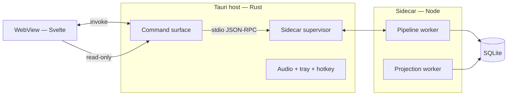

# Otto — Runtime, Inference, and Validation

> Status: accepted for MVP. §4's spike has been run and passed, so it no longer gates §1. Architecture in [`add.md`](./add.md); triage in [`triage.md`](./triage.md); settled decisions in [`docs/adr/`](./adr/).
>
> ADD §4 established three places code can run and why the split matters. It did not say how a TypeScript pipeline is hosted inside a Rust application, which local models satisfy the ports, or what would make the SQLite assumption pass or fail. Those are the decisions that have to hold before schema work starts, and they are here.

## 1. Process model and hosting

Otto is a Tauri application: a Rust host and a WebView running Svelte (ADD §4). The pipeline is TypeScript, which means something has to run it.

**The pipeline runs as a Node sidecar process, spawned and supervised by the Tauri host.**



The three alternatives and why they lost:

**Rewrite the pipeline in Rust.** The honest option, and rejected on ecosystem grounds rather than taste: the AI SDK, the provider clients, and Drizzle are all TypeScript, and reimplementing structured-output handling across three providers in Rust is a large amount of work with no product return. Otto's hard parts are extraction quality and triage, not throughput.

**Run the pipeline in the WebView.** Rejected by ADD §4's own argument — capture must stay cheap, and a WebView that is busy extracting is a capture window that stutters. It also makes the pipeline die when the window closes, which breaks the tray-resident model.

**Embed a JS runtime in the Rust process.** Rejected: it buys one fewer process at the cost of a constrained runtime, awkward native module support, and a crash surface shared with the host. A crashing sidecar should not take the tray down with it.

**The supervisor restarts the sidecar on exit** with backoff. Because the pipeline is resumable per stage (ADD §4), a restart resumes rather than replays, and a crash loop degrades to "captures accumulate" — the same behaviour as an unavailable provider (ADD §11), which is a state the system already handles.

**Transport is JSON-RPC over stdio.** No local HTTP port: nothing to conflict with, nothing to firewall, nothing to accidentally expose. This matters for a local-first application more than the ergonomics do.

**SQLite is opened by both processes** in WAL mode — the sidecar writes, the host reads on behalf of the WebView. Concurrent readers with a single writer is the case WAL is built for, and ADD §4 already serialises the pipeline to one Capture at a time, so there is exactly one writer by construction.

## 2. Local inference

PRD §4.6 and ADR-0008 make local operation a requirement rather than a preference. That is only meaningful with named models and stated budgets, since "degrades to local" is otherwise an aspiration.

### Transcription

**`whisper.cpp` with `small.en`, bundled.** The one port where local is non-negotiable (ADR-0008) — voice is the primary capture path, and a capture path that requires a network is not a local-first system.

| Property | Target |
|---|---|
| Latency | ≤ 2× realtime on an 8-core consumer machine |
| Accuracy | Word error rate low enough that entity names survive; see below |
| Size | ~500 MB, bundled with the application |

Name accuracy is the metric that matters, not general WER: "Sarah" transcribed as "Sara" is a resolution problem, and unusual names are exactly what a small model gets wrong. Two mitigations, both cheap: entity names from the projection are supplied to the transcriber as an initial prompt, which measurably improves proper-noun recall, and transcripts remain user-correctable (§5).

`large-v3` is offered as an optional download for users who want it. The bundled default optimises for working immediately.

### Extraction and adjudication

**Cloud by default, local supported, with a stated quality floor.**

| Path | Model | Notes |
|---|---|---|
| Default | Claude (Sonnet tier) | Best structured-output reliability; the quality bar the eval set is measured against |
| Alternative | OpenAI | Second adapter, same ports |
| Local | Qwen-class 7–8B instruct via LMStudio or Ollama, GBNF-constrained | The floor, not the target |

**The risk here is real and named**: schema-constrained extraction from a 7–8B model is the single most likely technical assumption in Otto to be wrong. Grammar-constrained decoding guarantees *parseable* output, not *correct* output — a local model reliably produces valid JSON and less reliably produces the right values in it.

Three things keep that from being a surprise:

**The eval set is the gate** (ADR-0006). Local extraction is measured against the same fixed corpus as cloud extraction, and its numbers are expected to be worse. The question is how much worse, answered with data rather than assumed.

**Thresholds are per model** (ADR-0008), so a weaker local model produces lower Confidence, which produces more review rather than more errors. The system degrades into asking more questions — which is the correct degradation, and is why `triage.md` §4's bootstrap applies per model version.

**Extraction is decomposed for local runs when necessary.** If whole-note extraction proves unreliable at 8B, the fallback is several narrower prompts — mentions first, then fields per mention — trading latency for reliability. Latency is affordable here because the pipeline is asynchronous (ADD §4) and nobody is waiting.

The floor Otto must clear to claim local support: **the local path produces a usable knowledge base with more review friction, not a corrupted one.** If the eval-set measurement shows an 8B model cannot clear that, the honest response is to raise the minimum local model size, not to quietly loosen thresholds. That measurement is the gate that remains — §4's storage spike has been run and passed, which leaves this the assumption in Otto most likely to be wrong.

### Embeddings

**`bge-small-en-v1.5` or equivalent, local always, no cloud option.** Embeddings are used for candidate generation, not user-facing search (ADD §9), the quality bar is "narrow thousands of entities to a handful," and sending every entity to a cloud provider for a job a 130 MB local model does well is a privacy cost with no return.

## 3. Idempotency and re-extraction

ADD §5.1 derives downstream ids deterministically from the Capture id so that replay is a no-op. That is correct for retries and wrong for model upgrades — re-extracting a Capture with a better model *should* produce new Proposals, and identical derivation would collapse them into no-ops.

**The derivation includes the model version.**

```
capture_id   = hash(source, source_timestamp, content_hash)
proposal_id  = hash(capture_id, stage, provider, model_version, ordinal)
```

A retry with the same model produces the same ids and is idempotent. A re-run under a new model produces new ids, and its Proposals arrive as ordinary Proposals subject to ordinary triage. Both behaviours fall out of one rule.

**Re-extraction is manual and scoped**, not automatic on upgrade. Silently re-processing history when a model changes would flood the review queue and re-litigate settled knowledge. It is an explicit action over a selected range of Captures, which makes it a tool for recovering from a known-bad extraction period rather than a background process.

**A re-extracted Proposal that matches current state closes silently.** Most re-extraction confirms what Otto already believes; only the differences are worth the user's attention.

## 4. The SQLite spike — run, passed

ADD §12 flagged SQLite as assumed and unvalidated and said the spike belonged before schema work. It has now been run. **All seven bars pass, the closest by a factor of 20.** The storage assumption holds and schema work is unblocked.

Implementation and full results: [`spikes/sqlite/`](../spikes/sqlite/), [`FINDINGS.md`](../spikes/sqlite/FINDINGS.md).

**Synthetic corpus**: 5 years of plausible single-user volume — 10,000 Captures, 41,240 events, 3,000 entities, 9,970 relations. Generated, not real, and biased toward the heavy end so a pass means comfortable rather than marginal.

| Measurement | Result | Pass | Fail |
|---|---|---|---|
| Full projection rebuild from event zero | **215 ms** | ≤ 60 s | > 5 min |
| Incremental projection catch-up, 100 events | **11.6 ms** | ≤ 500 ms | > 2 s |
| Entity view query — row + relations + provenance | **0.1 ms** | ≤ 50 ms | > 200 ms |
| Vector search over 3,000 entities, top-20 | **0.3 ms** | ≤ 100 ms | > 500 ms |
| Full-text search over 10,000 Captures | **1.7 ms** | ≤ 100 ms | > 500 ms |
| Event append with WAL, sidecar writing | **0.1 ms** | ≤ 10 ms | > 50 ms |
| Database size on disk | **47.8 MB** | ≤ 2 GB | > 10 GB |

Latencies are p95 over 200–500 iterations rather than means, since the bars read as user-facing promises and a median hides the stall a user would notice. Measured on an M1 Max with SQLite 3.49.2 under WAL; stable across five seeds. Nothing landed in the band between pass and fail.

Between pass and fail is the band where the design holds but needs attention — a snapshot cadence tightened, an index added. Nothing is in it, and the bars remain the standing performance suite (`qa.md` §8) precisely so that a later change that puts something there is caught.

**Vector search was expected to be the likeliest failure and was not.** `sqlite-vec` returns top-20 over 3,000 × 384d vectors in 0.3 ms against a 100 ms bar, and stays under it to 75,000 entities. The fallback — a separate on-disk index rebuilt from the log like any other projection (ADR-0005) — is not needed and should not be built. Two caveats carried forward: `sqlite-vec` is pre-1.0, and it is brute-force rather than ANN, so its cost grows linearly with entity count rather than logarithmically. At Otto's scale that is comfortable, and the linearity is what makes the numbers trustworthy.

**No bar failed, so snapshotting is not load-bearing.** It was measured anyway, because a full-rebuild failure would only have been fatal if snapshot-resumed rebuilds also failed: replaying the tail 10% of the log takes 24 ms against a 215 ms full rebuild. The mechanism works and ADR-0011 has its shape right; it is simply not needed yet. This settles the cadence question ADR-0011 left open — see §4.1.

**The measurement to distrust first is the projection logic, not the database.** The spike's projector folds events into typed columns with per-field provenance pointers, unions set-valued fields, supersedes single-valued ones, and resolves redirects transitively — but the real projector will also do salience, backlinks, and counts. If several bars degrade together once it does, the conclusion stated before the spike still stands: the projection model is doing too much work per event, not that a different database is needed.

### 4.1 Snapshot cadence: off for MVP

ADR-0011 made snapshot cadence a tuning parameter with no correct value until this spike measured rebuild cost. It has, and the answer is that there is nothing to tune yet.

Full rebuild is 215 ms at the specified corpus and 15 s at 25× it — one million events, roughly 125 years of use at the assumed rate. Snapshotting exists to keep rebuild proportional to recent activity, and rebuild is not a cost worth managing at those numbers. **Keep the mechanism, set the cadence to never, and revisit if the log passes ~1M events.** Building the machinery but not running it is deliberate: the mechanism is the part that is expensive to add later, and the cadence is a constant.

### 4.2 What the spike does not settle

Stated because a spike that overclaims is worse than none.

- **Embeddings are synthetic.** The spike measures the index, not retrieval quality. Whether candidate generation actually retrieves the right entities is an eval-set question (`qa.md` §6).
- **It is single-process.** The sidecar's real concurrency — the UI reading projections while the projection worker writes — is untested. WAL is built for that shape and ADD §4 serialises the pipeline, so the risk is low, but it remains an assumption.
- **Warm cache, SSD, M1 Max.** The numbers are a ceiling rather than a floor. The margins are wide enough that this does not change the verdict.
- **Capture-under-load is not measured here.** `qa.md` §8 requires capture to stay responsive while the pipeline is saturated. That is a process-model test and needs the real sidecar.

## 5. Captures, transcripts, and correction

Captures are immutable (ADR-0005, ADD §5.1). Transcription is imperfect (§2). Those two facts collide, and the collision needs an answer that does not weaken the immutability rule.

**The Capture stores both the raw transcript and, optionally, a user-corrected text.** Both are immutable once written; correcting a transcript appends a `CaptureTranscriptCorrected` event carrying the corrected text, and the original is never overwritten. The corrected text becomes what Extraction reads.

This keeps the rule intact — nothing is mutated, the correction is an event like any other, and provenance can still name exactly what text produced a given fact. It also means a mis-transcribed name is fixable by the user in one step rather than being a permanent wrong entity.

**Correcting a transcript re-runs the pipeline for that Capture**, under the re-extraction rules in §3. This is the one case where re-extraction is automatic, because the user has explicitly said the input was wrong.

**Typed Captures are not editable.** They were not misheard. Editing them would be note-editing, which PRD §6 excludes.
