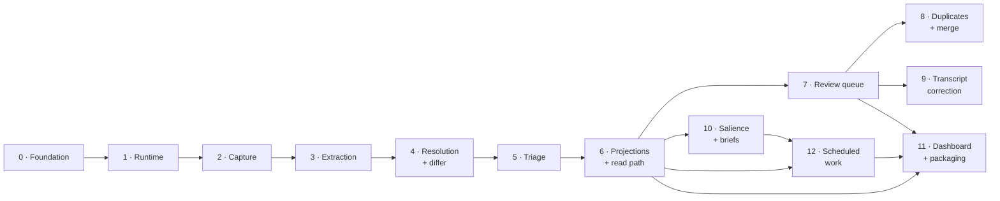

# Otto — MVP Slices

> Status: proposed. Derives from [`../prd.md`](../prd.md) §7.1 (MVP scope), [`../add.md`](../add.md) (structure), [`../qa.md`](../qa.md) §12 (execution order), and [`../adr/`](../adr/). Where this and those disagree, they are right and this is stale.
>
> This document decides no architecture. It sequences work already specified elsewhere into units that can be built, verified, and stopped between.

## How the slices are cut

Otto's MVP is one loop: capture → knowledge base → surfaced back (PRD §7.1). A vertical slice is a cut through that loop that leaves Otto working — every slice ends with something demonstrable and a suite that is green, not with a layer that waits for the next layer to mean anything.

Three constraints shaped the cuts.

**The write path is a chain, not a set.** Extraction cannot be built before Captures exist, resolution cannot be built before entities exist, and triage cannot be built before proposals exist. Slices 2–6 follow that chain in order because no reordering of them is available.

**The foundation cannot be a slice.** Slice 0 is horizontal and admits it. Lint rules, the event store, and the executor are what every later slice writes through, and building them incrementally per feature would mean building the one boundary ADR-0003 calls the highest-value in the tree four separate times. It is scoped to the smallest foundation that can carry a real event end to end, and it terminates in a demonstrable behaviour rather than in a directory tree.

**Trust-critical machinery ships with the feature it guards, never after.** Calibration sampling has no off switch and cannot be reconstructed retroactively (ADR-0006, `triage.md` §6), so it lands in the same slice as triage rather than in a later "calibration" slice. The same reasoning puts provenance in the projection slice and discard visibility in the triage slice: each is nearly free when built with its host and unreconstructable later.

## The slices

| # | Slice | Closes | Depends on |
|---|---|---|---|
| 0 | [Foundation](./00-foundation.md) | An event appended and read back, with the boundaries lint-enforced | — |
| 1 | [Runtime](./01-runtime.md) | Three processes that start, talk, and survive each other's failures | 0 |
| 2 | [Capture](./02-capture.md) | Typed and voice capture to a durable, immutable Capture | 1 |
| 3 | [Extraction](./03-extraction.md) | A Capture becomes Mentions and field values | 2 |
| 4 | [Resolution and the differ](./04-resolution-and-differ.md) | Mentions become Commands against real entities | 3 |
| 5 | [Triage](./05-triage.md) | Commands become applied events or queued Proposals | 4 |
| 6 | [Projections and the read path](./06-projections-and-read-path.md) | Knowledge is browsable with provenance | 5 |
| 7 | [Review queue](./07-review-queue.md) | The user confirms, corrects, and sees what Otto did | 6 |
| 8 | [Duplicates and merge](./08-duplicates-and-merge.md) | Two entities that are one become one | 7 |
| 9 | [Transcript correction](./09-transcript-correction.md) | A misheard name is fixable in one step | 7 |
| 10 | [Salience and briefs](./10-salience-and-briefs.md) | What deserves attention is surfaced daily and weekly | 6 |
| 12 | [Scheduled work](./12-scheduled-work.md) | Briefs and projection catch-up run on a schedule | 6, 10 |
| 11 | [Dashboard and packaging](./11-dashboard-and-packaging.md) | Otto is an application the user installs and lives in | 6, 7, 12 |

Slices 0–7 are a chain: each needs the one before it. After 7, three branches are independent of one another — 8, 9, and 10 touch different surfaces and can be built in any order or in parallel. Slice 12 follows 10 and supplies the briefs Slice 11 renders. Slice 11 is last because it is the one that has to see all of them.

Slice 12 is built before Slice 11 despite its higher number, having been cut after Slice 11 was written. Renumbering would invalidate slice references in merged pull requests and in `qa.md` §12.

## What is deliberately not a slice

**The local-extraction measurement is a gate, not a slice.** ADR-0013 and `runtime.md` §2 name it as the assumption in Otto most likely to be wrong, and PRD §9 lists it as gating implementation. It runs inside Slice 3 as that slice's exit condition, because the thing being measured is exactly what Slice 3 builds. If it fails, the response is a larger minimum local model, never looser thresholds.

**The SQLite spike is done.** It passed on all seven bars (`runtime.md` §4) and its measurements become the standing performance suite, which Slice 6 stands up against the real projector.

**Split is post-MVP** (PRD §7.2, ADR-0009). Slice 8 ships merge and tests that no split path exists.

**Semantic search, additional ingress, mobile, and calendar integration are post-MVP** (PRD §7.2). Each has a named seam and none of them opens in these slices.

## What every slice states

Each document below carries the same six headings, so a slice can be read for what it needs without reading the ones around it:

- **What it closes** — the user-visible or structurally-verifiable thing that is true at the end and was not true at the start.
- **Why here** — what forces its position in the order.
- **In scope** / **Not in scope** — the second is the more useful half, and names which slice picks up each exclusion.
- **Build order** — the steps inside the slice.
- **Verification** — the tests from `qa.md` that must be green, at that document's stated tier and rigour.
- **Done when** — the exit condition, stated so it can be checked rather than judged.
