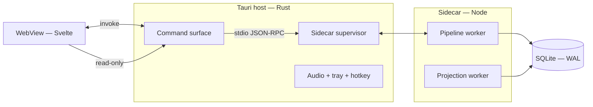

# Otto — Technology Stack

> Status: accepted for MVP, and derivative. Architecture in [`add.md`](./add.md); runtime and inference in [`runtime.md`](./runtime.md); settled decisions in [`docs/adr/`](./adr/).
>
> This document decides nothing. It collects the technology choices already made in `add.md`, `runtime.md`, and the ADRs into one place. Every row points at the document that owns it — **where this page and its source disagree, this page is wrong.**

## 1. How to read this

Otto is a local-first desktop application: a Rust host, a Svelte WebView, and a TypeScript pipeline in a Node sidecar, over one SQLite file. Nothing here is a service, and nothing here requires a network to function (PRD §6).

Two properties explain most of the choices below:

**Local must actually work, not nominally work.** ADR-0008 and PRD §4.6 make fully local operation a requirement. That is why transcription and embeddings have no cloud option at all, and why the local extraction path is named and budgeted rather than described as a fallback.

**Almost everything is derived.** The event log and Captures are the only truth (ADR-0005); entity tables, indexes, embeddings, and salience are projections. A technology that holds only derived state is cheap to replace — swapping the vector index is a rebuild rather than a migration, which is exactly what made changing it after the spike a low-cost decision.

## 2. The stack at a glance

| Layer | Choice | Owned by |
|---|---|---|
| Application shell | Tauri 2 — Rust host process | ADD §4, ADR-0013, ADR-0017 |
| Rust toolchain | 1.97.1, pinned in `rust-toolchain.toml` | ADR-0017 |
| UI | Svelte, in the WebView | ADD §3, §4 |
| Pipeline runtime | Node sidecar, TypeScript | ADR-0013, `runtime.md` §1 |
| Host ↔ sidecar transport | JSON-RPC over stdio | ADR-0013, `runtime.md` §1 |
| Audio capture | `cpal` — default input device, all three platforms | ADR-0017, `runtime.md` §2 |
| WAV encoding | `hound` — 16 kHz mono 16-bit, what whisper accepts | ADR-0017, `runtime.md` §2 |
| Database | SQLite, WAL mode | ADR-0005, ADR-0013 |
| SQLite driver | `better-sqlite3` — loads binary extensions | §8, `runtime.md` §4.3 |
| Test runner | Vitest | §8, `qa.md` §12 |
| Property-based testing | `fast-check` | §8, `qa.md` §3 |
| Query layer | Drizzle | ADD §3 |
| Vector index | SQLite-Vector 1.0 (`sqliteai/sqlite-vector`), loadable extension | `runtime.md` §4.3 |
| Full-text search | SQLite FTS | `runtime.md` §4 |
| Transcription | `whisper.cpp`, `small.en`, bundled | ADR-0013, `runtime.md` §2 |
| Extraction / adjudication — default | Qwen-class 7–8B instruct, GBNF-constrained, via LMStudio or Ollama | ADR-0016, `runtime.md` §2 |
| Extraction / adjudication — opt-in | Claude (Sonnet tier), OpenAI | ADR-0016, ADR-0008, `runtime.md` §2 |
| Embeddings | `bge-small-en-v1.5` or equivalent, local always | ADR-0013, `runtime.md` §2 |

## 3. Process model

Otto runs as three processes. The split is architectural: each boundary below exists for a stated reason, and ADD §4 owns it.

**Why a Node sidecar rather than Rust.** The provider clients, structured-output handling, and Drizzle are all TypeScript, and reimplementing them in Rust buys nothing the product needs — Otto's hard parts are extraction quality and triage, not throughput. `runtime.md` §1 has the full comparison, including the two other rejected options (pipeline in the WebView, embedded JS runtime).

**Why stdio rather than a local HTTP port.** Nothing to conflict with, nothing to firewall, nothing to accidentally expose. For a local-first application that matters more than the ergonomics.

**Why WAL.** The sidecar writes and the host reads on behalf of the WebView — concurrent readers with a single writer is the case WAL is built for, and ADD §4 serialises the pipeline to one Capture at a time, so there is exactly one writer by construction.

**Failure behaviour.** The supervisor restarts the sidecar with backoff. Because the pipeline is resumable per stage, a restart resumes rather than replays, and a crash loop degrades to "Captures accumulate" — the same state as an unavailable provider, which ADD §11 already handles.

## 4. Storage

**SQLite, one file, WAL mode.** Assumed by ADR-0005 and validated by the spike in `runtime.md` §4 — all seven bars passed over a synthetic 5-year corpus, the closest by a factor of 20.

**The vector index is SQLite-Vector 1.0** — [`sqliteai/sqlite-vector`](https://github.com/sqliteai/sqlite-vector), `runtime.md` §4.3. It is a loadable binary extension rather than an npm package, with prebuilt artefacts per platform, and it stores vectors as ordinary `BLOB` columns in ordinary tables — no virtual table. Otto stores Float32 and does not use the available quantization; §4.3 has the reasoning and the two things still to confirm — a re-measurement against the standing bar, and the licence.

The spike validated SQLite itself, not a dependency list — the packages its throwaway harness used are not decisions. The application's SQLite driver is unspecified; §8 records it as open.

**Snapshotting is built but switched off** (`runtime.md` §4.1). Full rebuild is 215 ms at the specified corpus; the cadence is set to never and revisited if the log passes ~1M events. The mechanism is the expensive part to add later; the cadence is a constant.

## 5. Inference

Ports are named after tasks, never after vendors (ADR-0008). `Extractor`, `Adjudicator`, `Transcriber`, and `Embedder` are the four that reach a model, and nothing in their signatures knows an LLM is involved — which is exactly what lets a fully local runtime satisfy them.

### Transcription — local, non-negotiable

**`whisper.cpp` with `small.en`, bundled**, at ≤2× realtime on an 8-core consumer machine. Voice is the primary capture path, and a capture path that requires a network is not a local-first system. `large-v3` is an optional download.

The metric is proper-noun recall rather than general word error rate: a mis-transcribed name is a resolution failure. Entity names from the projection are supplied to the transcriber as an initial prompt to improve it, and transcripts stay user-correctable (`runtime.md` §5).

### Extraction and adjudication — local default, cloud opt-in

| Path | Model | Notes |
|---|---|---|
| Default | Qwen-class 7–8B instruct, GBNF-constrained, via LMStudio or Ollama | What Otto runs with nothing configured (ADR-0016) |
| Opt-in | Claude (Sonnet tier) | Best structured-output reliability; the quality ceiling |
| Opt-in | OpenAI | Second adapter, same ports |

Otto is fully functional with no provider configured, and cloud is chosen per port rather than globally. This is the reverse of ADR-0013 as originally written; ADR-0016 has the reasoning.

Per-adapter differences are confined to *how* structured output is requested — tool use, JSON mode, or grammar constraints — over a shared prompt template in `infrastructure/llm/shared/` (ADR-0008).

**Thresholds are keyed by model and version** (ADR-0008). A confidence of 0.8 from a local model is not the same number as 0.8 from Claude, and provenance records provider and model version on every Proposal.

### Embeddings — local always, no cloud option

**`bge-small-en-v1.5` or equivalent.** Embeddings serve candidate generation rather than user-facing search (ADD §9), the quality bar is "narrow thousands of entities to a handful," and sending every entity to a provider for a job a 130 MB local model does well is a privacy cost with no return.

## 6. What the choices cost

- **Roughly 650 MB in the installer** before Otto's own code, from bundling `whisper.cpp` and an embedding model (ADR-0013). Accepted: working offline on first launch is worth more than a small download.
- **Three providers means three copies of the extraction prompt** drifting apart — the acknowledged cost of task-shaped ports (ADR-0008), mitigated by the shared template above.
- **A third process to supervise.** Rewriting the pipeline in Rust remains the option to revisit if the sidecar proves operationally annoying (ADR-0013).
- **The vector extension is a native binary per platform.** SQLite-Vector ships prebuilt artefacts rather than an npm package, so it joins `whisper.cpp` and the embedding model as something the installer must carry per target (`runtime.md` §4.3).

## 7. The assumption most likely to be wrong

**Schema-constrained extraction from a 7–8B local model.** Named as such in both ADR-0013 and `runtime.md` §2: grammar-constrained decoding guarantees *parseable* output, not *correct* output.

The floor Otto must clear to claim local support is that **the local path produces a usable knowledge base with more review friction, not a corrupted one.** If the eval set shows an 8B model cannot clear it, the response is to raise the minimum local model size, never to loosen thresholds to compensate.

**This is the one gate still open.** `prd.md` §9 lists two technical gates on implementation; the SQLite spike was the other and has passed. The local-extraction quality measurement has not been run.

## 8. Not yet decided

- ~~**Test framework and runner.**~~ **Decided in Slice 0: Vitest, with `fast-check` for property-based tests.** `qa.md` §12 step 3 makes the Tier 1 pure tests unstartable without a runner, so the decision belonged with the foundation. Vitest carries its own assertion library, so no third choice is needed.
- ~~**The SQLite driver.**~~ **Decided in Slice 0: `better-sqlite3`** — the driver the spike used, and confirmed to expose `loadExtension`, which `runtime.md` §4.3 anticipated needing for the vector extension in Slice 4 — in the event ADR-0021 kept vector search in process and no extension is loaded, so that capability is unused rather than load-bearing. Its synchronous API also suits a sidecar that serialises the pipeline to one Capture at a time (ADD §4).
- ~~**SQLite-Vector's licence.**~~ **Confirmed in Slice 4, and the answer moved the decision (ADR-0021).** `sqliteai/sqlite-vector` is dual-licensed: free for software under an OSI-approved licence, Elastic License 2.0 otherwise, with commercial terms required for production or managed-service deployment. Bundling it into a distributed installer is therefore a licensing decision contingent on Otto's own licence rather than a dependency addition. **Otto does not bundle it.** Vector search is exact and in process over `BLOB` columns, which the storage spike's own conclusion supports — exact search over this corpus sits far below the bar, so the design never depended on approximate indexing — and it re-measures at 13.8 ms p95 against the 100 ms bar. The extension stays cheap to adopt later, because embeddings are derived state and swapping the index is a projection rebuild; the trigger is entity count growing an order of magnitude, at which point the licence question has to be answered rather than deferred.
- ~~**The Rust toolchain version.**~~ **Decided in Slice 1: 1.97.1** (ADR-0017), pinned in `rust-toolchain.toml` so CI and every developer agree. The exact stable release rather than `stable` — an unpinned toolchain means a Rust release can break the build on a day nobody touched the code.
- ~~**The Tauri major version.**~~ **Decided in Slice 1: Tauri 2** (`tauri` 2.11.5, ADR-0017). A one-way door in practice — the plugin ecosystem, the JS API, and the config format all differ across majors, so moving later is a rewrite of the host rather than a version bump.
- ~~**The audio-capture crate.**~~ **Decided in Slice 1: `cpal` 0.18 for capture, `hound` 3.5 for the WAV** (ADR-0017). `cpal` records from the default input device on all three platforms; `hound` writes the 16 kHz mono 16-bit file `whisper.cpp` accepts in Slice 2. Nothing more — no mixing, no device selection UI, no format conversion beyond what whisper requires.
- ~~**How the sidecar reaches `whisper.cpp`.**~~ **Decided in Slice 2: by spawning the `whisper-cli` binary**, not through a native Node binding. A binding buys in-process speed that a port taking a file path cannot use anyway, and costs a compiled dependency rebuilt per Node version and per platform — on top of `better-sqlite3`, which is already one. The binary and model are located through `OTTO_WHISPER_BIN` and `OTTO_WHISPER_MODEL`, so swapping `small.en` for `large-v3` (`runtime.md` §2) is a path change; the model name recorded on each Capture is derived from the model filename rather than configured separately, so the two cannot drift. `--no-prints --no-timestamps` makes stdout the transcript and nothing else.
- **Build and packaging pipeline.** How the sidecar, `whisper.cpp`, the embedding model, and the vector extension are bundled into a Tauri installer per platform. Slice 1 introduced `src-tauri/` and pinned the rows above; Slice 2's shelling-out decision keeps the bundling question to "ship a binary and a model file." The installer, signing, and per-platform bundling stay open until Slice 11.
- **Svelte version and UI dependencies.** ADD §3 names Svelte; nothing specifies a version, router, or component approach. Slice 1's capture window is deliberately plain HTML — one input and no build step — so that this decision is made in Slice 11 against a dashboard that has something to answer to, rather than settled early by a window with one field in it.
- **How the sidecar's Node runtime ships** alongside the Tauri binary. Slice 1 takes the development answer only: the host spawns an installed Node, located through `OTTO_NODE`, running the script at `OTTO_SIDECAR`. Both are read in one function in the supervisor, which is what lets Slice 11 substitute a bundled runtime rather than rewriting it.
